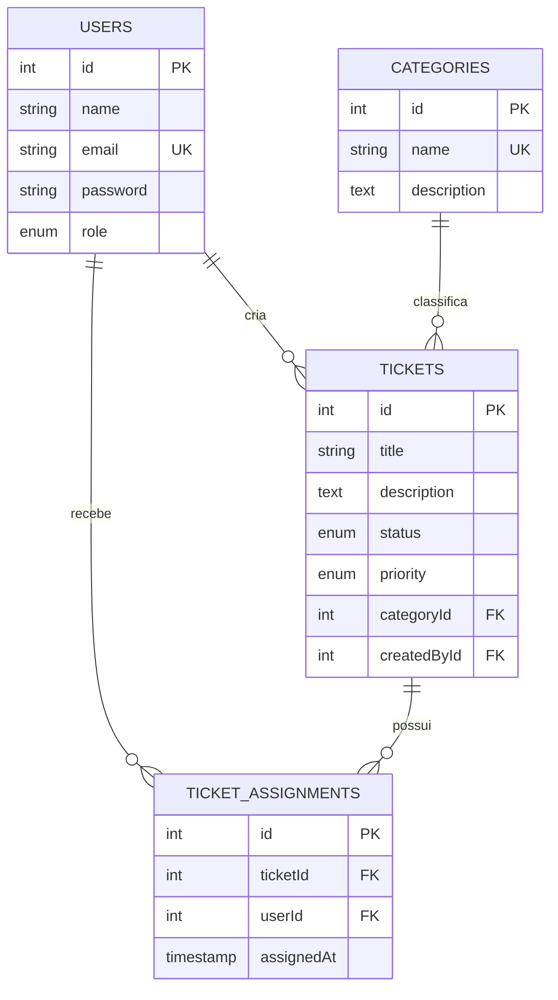

# DER

```mermaid
erDiagram
  USERS ||--o{ TICKETS : cria
  CATEGORIES ||--o{ TICKETS : classifica
  USERS ||--o{ TICKET_ASSIGNMENTS : recebe
  TICKETS ||--o{ TICKET_ASSIGNMENTS : possui

  USERS {
    int id PK
    string name
    string email UK
    string password
    enum role
  }

  CATEGORIES {
    int id PK
    string name UK
    text description
  }

  TICKETS {
    int id PK
    string title
    text description
    enum status
    enum priority
    int categoryId FK
    int createdById FK
  }

  TICKET_ASSIGNMENTS {
    int id PK
    int ticketId FK
    int userId FK
    timestamp assignedAt
  }
```
